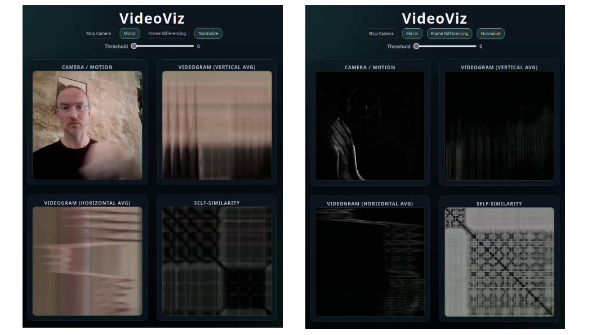

# VideoViz

Live camera visualisation with dual videograms, self-similarity matrix and optional motion (frame differencing) view. Try the [Live demo](https://alexarje.github.io/videoviz/) and check the [Wiki](https://github.com/alexarje/videoviz/wiki) for details. 

## Demo
Regular view:

Motion view (Frame Differencing):

## Musical Gestures Toolbox

This project is based on code from the [Musical Gestures Toolbox](https://github.com/fourMs/MGT-python/). Check it out if you want more advanced video visualisation features.
