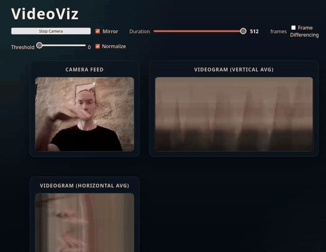
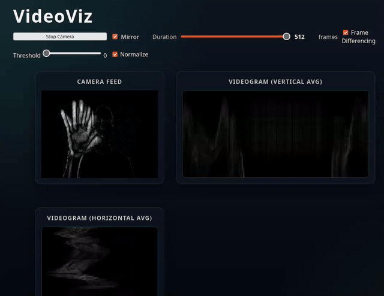

# Introducing VideoViz: live videograms from your webcam

VideoViz is a lightweight browser app that turns live camera video into two rolling “videograms” — compact visual timelines that make motion, rhythm, and structure in a scene easy to see at a glance.

It runs entirely in the browser (no build step), uses standard Web APIs, and can optionally switch into a motion-focused mode using frame differencing.

## What you see
VideoViz shows a 2×2 grid of synchronized views:

- **Camera / Motion**: a center-cropped square view of your webcam (or a motion/difference view when enabled)
- **Videogram (Horizontal Avg)**: a square scrolling history built from row-averaged pixels
- **Videogram (Vertical Avg)**: a square scrolling history built from column-averaged pixels
- **Self-similarity**: a similarity matrix over recent frames (raw video when differencing is off; diff video when on)

Together, these give you a “summary over time” that’s great for:

- exploring movement patterns (hands, gestures, dance, sports)
- observing periodic motion (fans, metronomes, oscillations)
- making quick visual studies of activity in a scene

## Quick look (GIFs)
Regular view:



Motion view (Frame Differencing):



## How videograms work (high level)
Each animation frame, VideoViz draws the camera frame to an offscreen canvas and reads back the pixels:

- For the **horizontal videogram**, it averages each column’s color over the full height, producing a 1‑pixel‑tall strip. New strips are inserted at the top and older history scrolls downward.
- For the **vertical videogram**, it averages each row’s color over the full width, producing a 1‑pixel‑wide strip. New strips are inserted at the left and older history scrolls to the right.

The result is a compact visualization of how the scene changes over time.

## Motion mode: frame differencing
Turn on **Frame Differencing** to visualize motion directly.

Instead of using raw camera pixels, the app computes a per-pixel grayscale difference between consecutive frames (with optional thresholding and normalization). This motion image is displayed, and the videograms are driven from the motion data — so moving parts pop out while static backgrounds fade away.

## Self-similarity matrix (SSM)
The **Self-similarity** panel shows how similar recent frames are to each other. Each axis is time, and each pixel encodes the similarity between two frames.

- The diagonal is “now vs now”.
- Repeating motion shows up as parallel diagonal bands.
- Sudden changes show up as block boundaries.

VideoViz builds the SSM from:

- **Raw video** when Frame Differencing is **off**
- **Motion/diff image** when Frame Differencing is **on**

## Key controls
- **Duration (fixed: 400)**: how many frames are kept in the rolling buffers. Higher values show more history but cost more CPU/memory.
- **Mirror**: mirrors the square camera/motion view.
- **Frame Differencing (default: off)**: toggles motion processing.
- **Threshold (default: 0)**: suppresses small pixel changes (noise).
- **Normalize (default: on)**: stretches motion intensity to the full 0–255 range so subtle movement is easier to see.

## Try it
- Live demo: https://alexarje.github.io/videoviz/
- Source + docs: https://github.com/alexarje/videoviz (see the Wiki for details)

## Run it locally
Because camera permissions are more reliable over `http://` than `file://`, serve the folder with a tiny local server:

```bash
python3 -m http.server 8080
```

Then open `http://localhost:8080` and click **Start Camera**.

